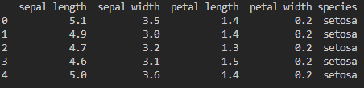
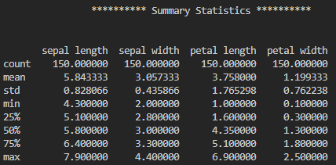
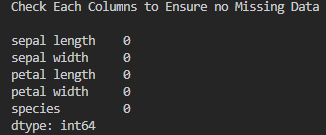

| Name: Sam Tracey                               |
|------------------------------------------------|
| Student Number: G00398245                      |
| Course: Programming and Scripting Project 2021 |
| Tutor: Andrew Beatty                           |

# 

# Introduction

This repository has been created to document my project work for the 2021
Programming and scripting module as part of a Higher Diploma in Data Analytics
with Galway and Mayo Institute of Technology.

Currently in my place of employment, Minitab 18 is used extensively for all data
analysis at a cost of €1709.70 per license [1]. This project concerns the
well-known Fisher’s Iris data set [2] and how it can be analysed using
exploratory data analysis and regression analysis with the Python programming
language.

As Python has been developed under an OSI-approved Open Source license [3] it is
free to use and readily available to anyone. Being able to use Python for data
analysis has a large cost saving implication for my employer.

# The Iris Dataset.

The Iris data set was first developed by British statistician Ronald Fisher in
1936\. It is a set of multivariate data quantifying the variation observed in
three related species of Iris flower: The Iris Setosa, Iris Virginica and Iris
Versicolor [4]. The data set has gained huge popularity in the programming and
machine learning communities with University of California Irvine going as far
as to claim it is the “best know database to be found in pattern recognition
literature” [5]

The data set itself is small but not trivial. Containing 150 unique observations
split evenly across the three species of Iris. For each observation there are
four distinct attributes detailed: Petal length, petal width, sepal length and
sepal width.

The popularity of the data set can be easily seen with a quick Google search. As
of writing there are current 42,600 entries on GitHub concerning the Iris data
set and a further 3836 entries on Kaggle.

Interestingly on both the UCI website where the data set is free to download and
on the Iris Data set Wikipedia page there is a reference to two mistakes that
exist in the data set stored online:

*“This data differs from the data presented in Fishers article (identified by
Steve Chadwick, spchadwick '@' espeedaz.net ). The 35th sample should be:
4.9,3.1,1.5,0.2,"Iris-setosa" where the error is in the fourth feature. The 38th
sample: 4.9,3.6,1.4,0.1,"Iris-setosa" where the errors are in the second and
third features.”*

Further investigation of Fisher’s paper [6] corroborated this statement and
there are mistakes on the 35th sample and 38th sample. For this body of work, I
amended the data set downloaded from University of California Irvine to match
Fisher’s data set as it was recorded originally.

# Methods

The following software, libraries and files were used throughout this project:

-   Python version 3.8.5 via Anaconda 2020.11

-   Minitab version 19

-   Visual Studio version 1.55.2

-   Numpy version 1.19.2

-   Pandas version 1.1.3

-   Matplotlib version 3.3.2

-   Dataframe-image version 0.1.1

-   Seaborn version 0.11.0

-   Scipy version 1.5.2

-   Statsmodels version 0.12.0

-   The Iris dataset imported from UCI at
    <https://archive.ics.uci.edu/ml/machine-learning-databases/iris/>

The purpose of this project is to compare the ability of Python and my company’s
current analytical software, Minitab 19, to performing exploratory data analysis
(EDA) and regression analysis to investigate the Iris data set.

# Exploratory Data Analysis

Exploratory data analysis or EDA for short is a term coined by American
mathematician John W Tukey to describe the act of looking at a data set to “see
what it seems to say” [7]. By using summary data, statistical graphics (such as
box plots, scatter plots and histograms for example) and other visualisation
techniques we attempt to investigate the data to understand patterns, detect
outliers and find interesting relationships amongst the variables [8].

## Loading the Iris Data Set

The first part of analysis in both Minitab and Python is to load the data to be
analysed into the software. Minitab provides a GUI to browse for a file to open
via Windows File Explorer. In Python we can read a comma-separated file into a
Dataframe named ‘data’ using only a single line of code and the built-in
functionality of the pandas library:

~~~~~~~~~~~~~~~~~~~~~~~~~~~~~~~~~~~~~~~~~~~~~~~~~~~~~~~~~~~~~~~~~~~~~~~~~~~~~~~~
data = pd.read_csv('iris.csv')
~~~~~~~~~~~~~~~~~~~~~~~~~~~~~~~~~~~~~~~~~~~~~~~~~~~~~~~~~~~~~~~~~~~~~~~~~~~~~~~~

Having read the data to our Dataframe we then proceed to assign headers for each
column of the Dataset:

~~~~~~~~~~~~~~~~~~~~~~~~~~~~~~~~~~~~~~~~~~~~~~~~~~~~~~~~~~~~~~~~~~~~~~~~~~~~~~~~
data.columns = ['sepal length', 'sepal width', 'petal length', 'petal width', 'species']
~~~~~~~~~~~~~~~~~~~~~~~~~~~~~~~~~~~~~~~~~~~~~~~~~~~~~~~~~~~~~~~~~~~~~~~~~~~~~~~~

Finally we can review the top 5 rows of the data set to ensure that our column
headers are in the correct place when compared with the original CSV file using
the line:

~~~~~~~~~~~~~~~~~~~~~~~~~~~~~~~~~~~~~~~~~~~~~~~~~~~~~~~~~~~~~~~~~~~~~~~~~~~~~~~~
print(data.head())
~~~~~~~~~~~~~~~~~~~~~~~~~~~~~~~~~~~~~~~~~~~~~~~~~~~~~~~~~~~~~~~~~~~~~~~~~~~~~~~~

The output from this command is displayed on the terminal:

We can compare this with the CSV file and see that they are identical except for
the column headers which we changed.

| sepal_length | sepal_width | petal_length | petal_width | species |
|--------------|-------------|--------------|-------------|---------|
| 5.1          | 3.5         | 1.4          | 0.2         | setosa  |
| 4.9          | 3           | 1.4          | 0.2         | setosa  |
| 4.7          | 3.2         | 1.3          | 0.2         | setosa  |
| 4.6          | 3.1         | 1.5          | 0.2         | setosa  |
| 5            | 3.6         | 1.4          | 0.2         | setosa  |

## Descriptive Statistics

Calculating descriptive statistics is often the first step in data analysis once
a data set has been loaded. Descriptive statistics are values that characterise
features of specific data presented in table or graph form. [9]

Minitab provides an option for descriptive statistics which presents the user
with the following summary table:

**Table 1. Minitab’s Descriptive Statistics Table For The Iris Data Set.**

In Python we can also generate a table of descriptive statistics using a few
lines of code [10]:

~~~~~~~~~~~~~~~~~~~~~~~~~~~~~~~~~~~~~~~~~~~~~~~~~~~~~~~~~~~~~~~~~~~~~~~~~~~~~~~~
print ('\t\t********** Summary Statistics **********')
print ('\n')
print (data.describe())
~~~~~~~~~~~~~~~~~~~~~~~~~~~~~~~~~~~~~~~~~~~~~~~~~~~~~~~~~~~~~~~~~~~~~~~~~~~~~~~~

This code prints the following information on screen:

**Table 2. Python Descriptive Statistics Table for The Iris Data Set.**

Comparing tables 1 and 2 we can see that both Minitab and Python detail the
mean, standard deviation, minimum, maximum and quantile information. The one
piece of information that is provided by Minitab but not Python is the number of
entries with missing data. This can be output in Python with another few lines
of code [11]:

~~~~~~~~~~~~~~~~~~~~~~~~~~~~~~~~~~~~~~~~~~~~~~~~~~~~~~~~~~~~~~~~~~~~~~~~~~~~~~~~
print('Check Each Column to Ensure no Missing Data\n')
print(data.isnull().sum())
~~~~~~~~~~~~~~~~~~~~~~~~~~~~~~~~~~~~~~~~~~~~~~~~~~~~~~~~~~~~~~~~~~~~~~~~~~~~~~~~

**Table 3. Python Console Output Detailing The Number of Missing Data Points.**

It is also possible to split the original Dataframe that we created in Python to
provide descriptive statistics for the three species of Iris separately [12]:

~~~~~~~~~~~~~~~~~~~~~~~~~~~~~~~~~~~~~~~~~~~~~~~~~~~~~~~~~~~~~~~~~~~~~~~~~~~~~~~~
setosa = data.loc[data.species== 'setosa',:]
dfi.export(setosa.describe(), 'table_2.png')
versicolor = data.loc[data.species== 'versicolor',:]
dfi.export(versicolor.describe(), 'table_3.png')
virginica = data.loc[data.species== 'virginica',:]
dfi.export(virginica.describe(), 'table_4.png')
~~~~~~~~~~~~~~~~~~~~~~~~~~~~~~~~~~~~~~~~~~~~~~~~~~~~~~~~~~~~~~~~~~~~~~~~~~~~~~~~

I have used the dfi.export function in this case to export the three separate
descriptive statistics tables as .png files to the project folder. [13]

**Table 4. Descriptive Statistics for Setosa Species**

**Table 5. Descriptive Statistics for Versicolor Species**

**Table 6. Descriptive Statistics for Virginica Species**

## Graphical Displays

We use graphical displays as they complement tabular data that we obtain from
descriptive statistics. Graphs are often easier to interpret and better suited
to identifying patterns in the underlying data set than tables. We are going to
further analyse the Iris data set using Box Plots, scatter plots, distribution
plots (KDE) and pair plots using both Minitab and Python.

### Boxplots

Also known as box and whisker plots, the boxplot displays values of the
quantiles using a rectangular box. The top and bottom ends of the box illustrate
quantiles one and three while the line drawn across the middle of the box
depicts the median or quantile two. The lines extending outwards from the
rectangular box are known as the whiskers. These whiskers represent the ranges
for the bottom 25% and top 25% of data. If there are any outliers in the data
these will be represented by asterisks.

**Figure 1. Anatomy of the box plot [14].**

Using Minitab we can create boxplots for all the variables (sepal length, sepal
width, petal length and petal width) then colour each of the variables by an
attribute – in this case we’ve coloured by species. We can also add a mean
symbol to each box plot.

**Figure 2. Box plots of the Iris Data Set variables using Minitab.**

To replicate this output in Python we make use of the Seaborn library to create
the box plots. Initially I had separate lines of code to display each box plot
separately but was able to research a method to use a for loop to iterate
through each of the columns in a DataFrame plotting a box plot for each one and
saving these plots to a folder as .png files.[15]

~~~~~~~~~~~~~~~~~~~~~~~~~~~~~~~~~~~~~~~~~~~~~~~~~~~~~~~~~~~~~~~~~~~~~~~~~~~~~~~~
sns.set(style='darkgrid')

 column in data.columns[:4]:  
    sns.set()
    fig, ax = plt.subplots()
    sns.set(style='ticks')
    sns.boxplot(x='species',
            y=column,                                       
            data=data,                                      
            order=['versicolor', 'virginica', 'setosa'],
            showmeans = True,                               
            meanprops={'marker':'o',                        
                       'markerfacecolor':'white', 
                       'markeredgecolor':'black',
                       'markersize':'10'})

    
    sns.despine(offset=10, trim=True)
    plt.title('Box Plot of {}'.format(column), fontsize=20)
    fig.set_size_inches(8, 8)
    plt.savefig('Boxplot_of_{}.png'.format(column), dpi=300)  
plt.close()
~~~~~~~~~~~~~~~~~~~~~~~~~~~~~~~~~~~~~~~~~~~~~~~~~~~~~~~~~~~~~~~~~~~~~~~~~~~~~~~~

This block of code produces four separate boxplots which are saved to a folder.
The boxplots produced are displayed below:

**Figure 3. Box plots of the Iris Data Set variables using Python.**

### Density Plots

A density plot represents the distribution of a numeric variable. It is
essentially a smoothed version of the histogram plot. [16] We use density plots
to investigate the distribution of the underlying data and is typically one of
the first tasks we would undertake when performing analysis of any data set.

Using Minitab we can create a histogram graph for each variable in the Irish
Data set, plot a distribution line of the data and then remove the histogram
bars. This generates density plots as shown below:

**Figure 4. Density plots of the Iris Data Set variables using Minitab.**

Once again, using the Seaborn library we can replicate this output in Python.
Using the same for loop concept as described in the boxplot section we can
iterate over each of the columns in our DataFrame, create the four density plots
and save the output of the four separate plots to our folder [17]:

~~~~~~~~~~~~~~~~~~~~~~~~~~~~~~~~~~~~~~~~~~~~~~~~~~~~~~~~~~~~~~~~~~~~~~~~~~~~~~~~
for column in data.columns[:4]:  # Loop over all columns except 'Species'
    sns.set()
    fig, ax = plt.subplots()  
    sns.kdeplot(data=data, x=column, hue='species')    
    plt.title('Kernal Density Estimation (KDE) Plot of {}'.format(column), fontsize=20)
    fig.set_size_inches(8, 8)
    plt.savefig('KDE_of_{}.png'.format(column), dpi=300)  # filename based on column name in Iris Data set
plt.close('all')
~~~~~~~~~~~~~~~~~~~~~~~~~~~~~~~~~~~~~~~~~~~~~~~~~~~~~~~~~~~~~~~~~~~~~~~~~~~~~~~~

The plots below are output:

**Figure 5. Density plots of the Iris Data Set variables using Python.**

You will notice that there are distinct differences between the output of the
density plots generated in Python compared to those from Minitab. Where Minitab
only allows you to display a normal distribution over for each variable the
Seaborn library in Python uses Kernal Density Estimation (KDE) and, while beyond
the scope of this paper, kernel density estimates converge faster to the true
underlying density for continuous random variables such as those in the Iris
data set. [18]

The output from the Seaborn KDE graphs is a better depiction of the true density
distributions for our data set.

[1] Minitab (2021) *Single User Annual Subscription License.* Available at:
<https://store.minitab.com/781/purl-minitab> Accessed (04 April 2021)

[2] University of California Irvine (2021) *Iris* *Data Set* Available at:
(<https://archive.ics.uci.edu/ml/datasets/iris> Accessed (04 April 2021)

[3] Python (2021) *History and License* Available at:
<https://docs.python.org/3/license.html> Accessed (04 April 2021)

[4] Wikipedia (2021) *Iris Flower Data Set* Available at:
<https://en.wikipedia.org/wiki/Iris_flower_data_set> Accessed (13-April-2021)

[5] University of California Irvine (2021) *Iris Data Set* Available at:
(<https://archive.ics.uci.edu/ml/datasets/iris> Accessed (13 April 2021)

[6] Fisher,R.A. "The use of multiple measurements in taxonomic problems" Annual
Eugenics, 7, Part II, 179-188 (1936); also in "Contributions to Mathematical
Statistics" (John Wiley, NY, 1950) Available at:
https://onlinelibrary.wiley.com/doi/pdf/10.1111/j.1469-1809.1936.tb02137.x
Accessed (07 April 2021)

[7] Morgenthaler, S. (2009), Exploratory data analysis. WIREs Comp Stat, 1:
33-44. Available at: <https://doi.org/10.1002/wics.2> Accessed (14 April 2021)

[8] IBM (2020) *Exploratory Data Analysis*. Available at:
[https://www.ibm.com/cloud/learn/exploratory-data-analysis\#toc-what-is-ex-ofRUduQ6](https://www.ibm.com/cloud/learn/exploratory-data-analysis#toc-what-is-ex-ofRUduQ6)
Accessed (14 April 2021)

[9] Larson, M. G. (2006) ‘Descriptive Statistics and Graphical Displays’,
*Circulation*, 114(1), pp. 76–81. doi:
[10.1161/CIRCULATIONAHA.105.584474](https://doi.org/10.1161/CIRCULATIONAHA.105.584474).

[10] Pandas, 2021 pandas.DataFrame.describe. Available at:
https://pandas.pydata.org/docs/reference/api/pandas.DataFrame.describe.html
Accessed (02 April 2021)

[11] Real Python (2018) Pythonic Data Cleaning With Pandas and NumPy. Available
at: <https://realpython.com/python-data-cleaning-numpy-pandas/> Accessed (02
April 2021)

[12] Pandas (2021) Cookbook. Available at:
[https://pandas.pydata.org/pandas-docs/stable/user_guide/cookbook.html Accessed
(03](https://pandas.pydata.org/pandas-docs/stable/user_guide/cookbook.html%20Accessed%20(03)
April 2021)

[13] Stack Overflow (2016) How to save a pandas DataFrame table as a png.
Available at:
[https://stackoverflow.com/questions/35634238/how-to-save-a-pandas-dataframe-table-as-a-png/63387275\#63387275](https://stackoverflow.com/questions/35634238/how-to-save-a-pandas-dataframe-table-as-a-png/63387275#63387275)
Accessed (02 April 2021)

[14] The Data Visualization Catalog (2021). Box and Whisker Plot. Available at:
[https://datavizcatalogue.com/methods/box_plot.html Accessed
(17](https://datavizcatalogue.com/methods/box_plot.html%20Accessed%20(17) April
2021)

[15] Visualization - how to create multiple subplots( scatterplot) in for loop -
Data Science Stack Exchange (no date). Available at:
<https://datascience.stackexchange.com/questions/84840/how-to-create-multiple-subplots-scatterplot-in-for-loop>
(Accessed: 3 April 2021).

[16] From Data to Viz. Density. Available at:
[https://www.data-to-viz.com/graph/density.html\#definition](https://www.data-to-viz.com/graph/density.html#definition)
Accessed (17 April 2021).

[17] Seaborn (Unknown) Visualizing distributions of data. Available at:
[https://seaborn.pydata.org/tutorial/distributions.html Accessed
(07](https://seaborn.pydata.org/tutorial/distributions.html%20Accessed%20(07)
April 2021)

[18] Wikipedia (2021) Kernal Density Estimation. Available at:
[https://en.wikipedia.org/wiki/Kernel_density_estimation Accessed
(17](https://en.wikipedia.org/wiki/Kernel_density_estimation%20Accessed%20(17)
April 2021)
