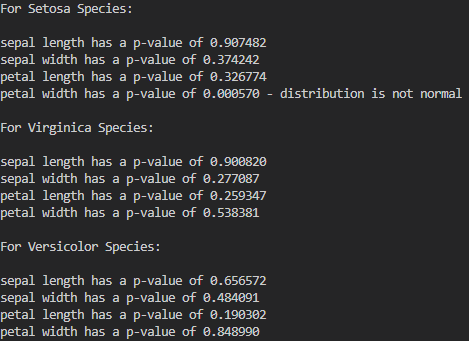
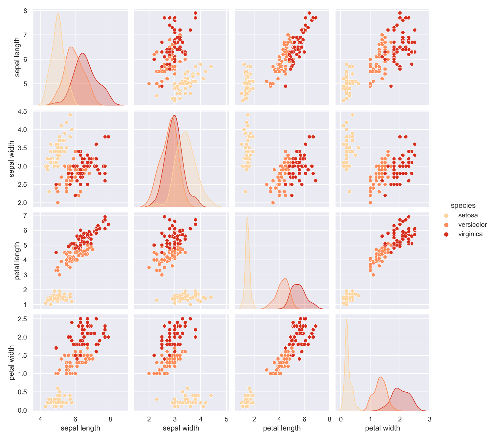
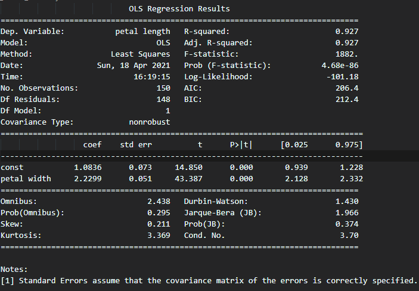
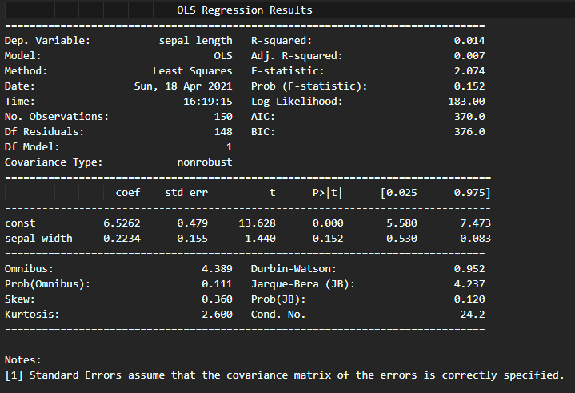
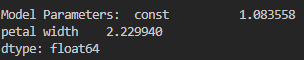

| Name: Sam Tracey                               |
|------------------------------------------------|
| Student Number: G00398245                      |
| Course: Programming and Scripting Project 2021 |
| Tutor: Andrew Beatty                           |

# 

# Introduction

This repository has been created to document my project work for the 2021
Programming and scripting module as part of a Higher Diploma in Data Analytics
with Galway and Mayo Institute of Technology.

Currently in my place of employment, Minitab 19 is used extensively for all data
analysis at a cost of €1709.70 per license [1]. This project concerns the
well-known Fisher’s Iris data set [2] and how it can be analysed using
exploratory data analysis and regression analysis with the Python programming
language.

As Python has been developed under an OSI-approved Open Source license [3] it is
free to use and readily available to anyone. Being able to use Python for data
analysis has a large cost saving implication for my employer.

# The Iris Dataset.

The Iris data set was first developed by British statistician Ronald Fisher in
1936\. It is a set of multivariate data quantifying the variation observed in
three related species of Iris flower: The Iris Setosa, Iris Virginica and Iris
Versicolor [4]. The data set has gained huge popularity in the programming and
machine learning communities with University of California Irvine going as far
as to claim it is the “best known database to be found in pattern recognition
literature” [5]

The data set itself is small but not trivial. Containing 150 unique observations
split evenly across the three species of Iris. For each observation there are
four distinct attributes detailed: Petal length, petal width, sepal length and
sepal width.

The popularity of the data set can be easily seen with a quick Google search. As
of the time of writing there are currently 42,600 entries on GitHub concerning
the Iris data set and a further 3836 entries on Kaggle.

Interestingly on both the UCI website where the data set is free to download and
on the Iris Data set Wikipedia page there is a reference to two mistakes that
exist in the data set stored online:

*“This data differs from the data presented in Fishers article (identified by
Steve Chadwick, spchadwick '@' espeedaz.net ). The 35th sample should be:
4.9,3.1,1.5,0.2,"Iris-setosa" where the error is in the fourth feature. The 38th
sample: 4.9,3.6,1.4,0.1,"Iris-setosa" where the errors are in the second and
third features.”*

Further investigation of Fisher’s paper [6] corroborated this statement and
there are mistakes on the 35th sample and 38th sample. For this body of work, I
amended the data set downloaded from University of California Irvine to match
Fisher’s data set as it was recorded originally.

# Methods

The following software, modules and files were used throughout this project:

-   Python version 3.8.5 via Anaconda 2020.11

-   Minitab version 19

-   Visual Studio version 1.55.2

-   Numpy version 1.19.2

-   Pandas version 1.1.3

-   Matplotlib version 3.3.2

-   Dataframe-image version 0.1.1

-   Seaborn version 0.11.0

-   Scipy version 1.5.2

-   Statsmodels version 0.12.0

-   The Iris dataset imported from UCI at
    <https://archive.ics.uci.edu/ml/machine-learning-databases/iris/>

The purpose of this project is to compare the ability of Python and my company’s
current analytical software, Minitab 19, to carry out exploratory data analysis
and linear regression modelling on a data set. I will be treating the Iris data
set as I would any other data set with which I am not overly familiar using both
Minitab and Python.

While I will give some details on the statistical tools used, I will not be
going into great detail on the techniques themselves. This goal of this project
is to determine if Python could be used to replace our current software package
for everyday analysis.

# Exploratory Data Analysis

Exploratory data analysis or EDA for short is a term coined by American
mathematician John W Tukey to describe the act of looking at a data set to “see
what it seems to say” [7]. By using summary data, statistical graphics (such as
box plots, scatter plots and histograms for example) and other visualisation
techniques we attempt to investigate the data to understand patterns, detect
outliers and find interesting relationships amongst the variables [8].

## Importing the Necessary Modules and Loading the Iris Data Set

The first part of analysis in both Minitab and Python is to import all modules
that we will be using and to load the data to be analysed into the software.

~~~~~~~~~~~~~~~~~~~~~~~~~~~~~~~~~~~~~~~~~~~~~~~~~~~~~~~~~~~~~~~~~~~~~~~~~~~~~~~~
# Import the necessary modules
from contextlib import redirect_stdout
import numpy as np
import pandas as pd
import matplotlib.pyplot as plt
import dataframe_image as dfi
import seaborn as sns
import scipy.stats as stats
import statsmodels.api as sm
~~~~~~~~~~~~~~~~~~~~~~~~~~~~~~~~~~~~~~~~~~~~~~~~~~~~~~~~~~~~~~~~~~~~~~~~~~~~~~~~

You can check to ensure that you have the necessary modules installed on your
environment by using the following command in your terminal:

~~~~~~~~~~~~~~~~~~~~~~~~~~~~~~~~~~~~~~~~~~~~~~~~~~~~~~~~~~~~~~~~~~~~~~~~~~~~~~~~
pip list
~~~~~~~~~~~~~~~~~~~~~~~~~~~~~~~~~~~~~~~~~~~~~~~~~~~~~~~~~~~~~~~~~~~~~~~~~~~~~~~~

If you do not see one of the modules I have imported when you run your pip list
command, you can install specific modules with the following command in your
terminal (replace SomePackage with the name of the missing module):

~~~~~~~~~~~~~~~~~~~~~~~~~~~~~~~~~~~~~~~~~~~~~~~~~~~~~~~~~~~~~~~~~~~~~~~~~~~~~~~~
python -m pip install SomePackage
~~~~~~~~~~~~~~~~~~~~~~~~~~~~~~~~~~~~~~~~~~~~~~~~~~~~~~~~~~~~~~~~~~~~~~~~~~~~~~~~

Minitab provides a GUI to browse for a file to open via Windows File Explorer.
In Python we can read a comma-separated file into a Dataframe named ‘data’ using
only a single line of code and the built-in functionality of the pandas module:

~~~~~~~~~~~~~~~~~~~~~~~~~~~~~~~~~~~~~~~~~~~~~~~~~~~~~~~~~~~~~~~~~~~~~~~~~~~~~~~~
data = pd.read_csv('iris.csv')
~~~~~~~~~~~~~~~~~~~~~~~~~~~~~~~~~~~~~~~~~~~~~~~~~~~~~~~~~~~~~~~~~~~~~~~~~~~~~~~~

Having read the data to our Dataframe we then proceed to assign headers for each
column of the Dataset:

~~~~~~~~~~~~~~~~~~~~~~~~~~~~~~~~~~~~~~~~~~~~~~~~~~~~~~~~~~~~~~~~~~~~~~~~~~~~~~~~
data.columns = ['sepal length', 'sepal width', 'petal length', 'petal width', 'species']
~~~~~~~~~~~~~~~~~~~~~~~~~~~~~~~~~~~~~~~~~~~~~~~~~~~~~~~~~~~~~~~~~~~~~~~~~~~~~~~~

Finally we can review the top 5 rows of the data set to ensure that our column
headers are in the correct place when compared with the original CSV file using
the line:

~~~~~~~~~~~~~~~~~~~~~~~~~~~~~~~~~~~~~~~~~~~~~~~~~~~~~~~~~~~~~~~~~~~~~~~~~~~~~~~~
print(data.head())
~~~~~~~~~~~~~~~~~~~~~~~~~~~~~~~~~~~~~~~~~~~~~~~~~~~~~~~~~~~~~~~~~~~~~~~~~~~~~~~~

The output from this command is displayed on the terminal:

We can compare this with the CSV file and see that they are identical except for
the column headers which we changed.

| sepal_length | sepal_width | petal_length | petal_width | species |
|--------------|-------------|--------------|-------------|---------|
| 5.1          | 3.5         | 1.4          | 0.2         | setosa  |
| 4.9          | 3           | 1.4          | 0.2         | setosa  |
| 4.7          | 3.2         | 1.3          | 0.2         | setosa  |
| 4.6          | 3.1         | 1.5          | 0.2         | setosa  |
| 5            | 3.6         | 1.4          | 0.2         | setosa  |

## 

## 

## Descriptive Statistics

Calculating descriptive statistics is often the first step in data analysis once
a data set has been loaded. Descriptive statistics are values that characterise
features of specific data presented in table or graph form. [9]

Minitab provides an option for descriptive statistics which presents the user
with the following summary table:

**Table 1. Minitab’s Descriptive Statistics Table For The Iris Data Set.**
 
 

In Python we can also generate a table of descriptive statistics using a few
lines of code [10]:

~~~~~~~~~~~~~~~~~~~~~~~~~~~~~~~~~~~~~~~~~~~~~~~~~~~~~~~~~~~~~~~~~~~~~~~~~~~~~~~~
print ('\t\t********** Summary Statistics **********')
print ('\n')
print (data.describe())
~~~~~~~~~~~~~~~~~~~~~~~~~~~~~~~~~~~~~~~~~~~~~~~~~~~~~~~~~~~~~~~~~~~~~~~~~~~~~~~~

This code prints the following information on screen:

**Table 2. Python Descriptive Statistics Table for The Iris Data Set.**
 
 
 

Comparing tables 1 and 2 we can see that both Minitab and Python detail the
mean, standard deviation, minimum, maximum and quantile information. The one
piece of information that is provided by Minitab but not Python is the number of
entries with missing data. This can be output in Python with another few lines
of code [11]:

~~~~~~~~~~~~~~~~~~~~~~~~~~~~~~~~~~~~~~~~~~~~~~~~~~~~~~~~~~~~~~~~~~~~~~~~~~~~~~~~
print('Check Each Column to Ensure no Missing Data\n')
print(data.isnull().sum())
~~~~~~~~~~~~~~~~~~~~~~~~~~~~~~~~~~~~~~~~~~~~~~~~~~~~~~~~~~~~~~~~~~~~~~~~~~~~~~~~

**Table 3. Python Console Output Detailing The Number of Missing Data Points.**
 
 
 

It is also possible to split the original Dataframe that we created in Python to
provide descriptive statistics for the three species of Iris separately [12]:

~~~~~~~~~~~~~~~~~~~~~~~~~~~~~~~~~~~~~~~~~~~~~~~~~~~~~~~~~~~~~~~~~~~~~~~~~~~~~~~~
setosa = data.loc[data.species== 'setosa',:]
dfi.export(setosa.describe(), 'table_2.png')
versicolor = data.loc[data.species== 'versicolor',:]
dfi.export(versicolor.describe(), 'table_3.png')
virginica = data.loc[data.species== 'virginica',:]
dfi.export(virginica.describe(), 'table_4.png')
~~~~~~~~~~~~~~~~~~~~~~~~~~~~~~~~~~~~~~~~~~~~~~~~~~~~~~~~~~~~~~~~~~~~~~~~~~~~~~~~

I have used the dfi.export function in this case to export the three separate
descriptive statistics tables as .png files to the project folder. [13]

**Table 4. Descriptive Statistics for Setosa Species**
 
 
 

**Table 5. Descriptive Statistics for Versicolor Species**
 
 
 

**Table 6. Descriptive Statistics for Virginica Species**
 
 
 

## Graphical Displays

We use graphical displays as they complement tabular data that we obtain from
descriptive statistics. Graphs are often easier to interpret and better suited
to identifying patterns in the underlying data set than tables. We are going to
further analyse the Iris data set using Box Plots, scatter plots, density plots
(KDE) and pair plots using both Minitab and Python.

### Boxplots

Also known as box and whisker plots, the boxplot displays values of the
quantiles using a rectangular box. The top and bottom ends of the box illustrate
quantiles one and three while the line drawn across the middle of the box
depicts the median or quantile two. The lines extending outwards from the
rectangular box are known as the whiskers. These whiskers represent the ranges
for the bottom 25% and top 25% of data. If there are any outliers in the data
these will be represented by asterisks.

**Figure 1. Anatomy of the box plot [14].**
 
 
 

Using Minitab we can create boxplots for all the variables (sepal length, sepal
width, petal length and petal width) then colour each of the variables by an
attribute – in this case we’ve coloured by species. We can also add a mean
symbol to each box plot. Adding a mean symbol as well as the median line gives
us an indication of any skewness that may exist in the data.

**Figure 2. Box plots of the Iris Data Set variables using Minitab.**
 
 
 

To replicate this output in Python we make use of the Seaborn module to create
the box plots. Initially I had separate lines of code to display a box plot for
each column of data but was able to research a method to use a for loop to
iterate through each of the columns in a DataFrame plotting a box plot for each
one and saving these plots to a folder as .png files.[15]

~~~~~~~~~~~~~~~~~~~~~~~~~~~~~~~~~~~~~~~~~~~~~~~~~~~~~~~~~~~~~~~~~~~~~~~~~~~~~~~~
sns.set(style='darkgrid')

 column in data.columns[:4]:  
    sns.set()
    fig, ax = plt.subplots()
    sns.set(style='ticks')
    sns.boxplot(x='species',
            y=column,                                       
            data=data,                                      
            order=['versicolor', 'virginica', 'setosa'],
            showmeans = True,                               
            meanprops={'marker':'o',                        
                       'markerfacecolor':'white', 
                       'markeredgecolor':'black',
                       'markersize':'10'})

    
    sns.despine(offset=10, trim=True)
    plt.title('Box Plot of {}'.format(column), fontsize=20)
    fig.set_size_inches(8, 8)
    plt.savefig('Boxplot_of_{}.png'.format(column), dpi=300)  
plt.close()
~~~~~~~~~~~~~~~~~~~~~~~~~~~~~~~~~~~~~~~~~~~~~~~~~~~~~~~~~~~~~~~~~~~~~~~~~~~~~~~~

This block of code produces four separate boxplots which are saved to a folder.
The boxplots produced are displayed below:

**Figure 3. Box plots of the Iris Data Set variables using Python.**
 
 
 

### Density Plots

A density plot represents the distribution of a numerical variable. It is
essentially a smoothed version of the histogram plot. [16] We use density plots
to investigate the distribution of the underlying data and is typically one of
the first tasks we would undertake when performing analysis of any data set.

Using Minitab we can create a histogram graph for each variable in the Irish
Data set, plot a distribution line of the data and then remove the histogram
bars. This generates density plots as shown below:

**Figure 4. Density plots of the Iris Data Set variables using Minitab.**

Once again, using the Seaborn module we can replicate this output in Python.
Using the same for loop concept as described in the boxplot section we can
iterate over each of the columns in our DataFrame, create the four density plots
and save the output of the four separate plots to our folder [17]:

~~~~~~~~~~~~~~~~~~~~~~~~~~~~~~~~~~~~~~~~~~~~~~~~~~~~~~~~~~~~~~~~~~~~~~~~~~~~~~~~
for column in data.columns[:4]:  # Loop over all columns except 'Species'
    sns.set()
    fig, ax = plt.subplots()  
    sns.kdeplot(data=data, x=column, hue='species')    
    plt.title('Kernal Density Estimation (KDE) Plot of {}'.format(column), fontsize=20)
    fig.set_size_inches(8, 8)
    plt.savefig('KDE_of_{}.png'.format(column), dpi=300)  # filename based on column name in Iris Data set
plt.close('all')
~~~~~~~~~~~~~~~~~~~~~~~~~~~~~~~~~~~~~~~~~~~~~~~~~~~~~~~~~~~~~~~~~~~~~~~~~~~~~~~~

The plots below are output:

**Figure 5. Density plots of the Iris Data Set variables using Python.**

You will notice that there are distinct differences between the output of the
density plots generated in Python compared to those from Minitab. Where Minitab
only allows you to display a normal distribution for each variable the Seaborn
module in Python uses Kernal Density Estimation (KDE) and, while beyond the
scope of this paper, kernel density estimates converge faster to the true
underlying density for continuous random variables such as those in the Iris
data set. [18]

The output from the Seaborn KDE graphs is a better depiction of the true density
distributions for our data set.

## Normality Testing

Before we begin to look at statistical methods such as correlation or regression
one basic assumption required for these tools must be evaluated: The test for
normality. From our density plots (and to a certain extent our boxplots) we can
‘guesstimate’ that the continuous data we have for each variable of each species
is relatively normal. For example, in the boxplots we see, for the most part,
that the mean and median are roughly the same and from the density plots we can
see that there is some symmetry to the distributions. However, to truly
determine if the data follows a normal distribution, we need to calculate a
specific statistic – the P-value. When we calculate the P-value, a value less
than 0.05 indicates that the data does not follow the normal distribution while
a value greater than 0.05 indicates that the data does follow the normal
distribution. [19]

With Minitab we can check the normality for each variable by generating a
summary report and evaluating the P-value:

**Figure 6. Evaluating the normality of the petal length for the Setosa species
in Minitab.**

Normality testing in Python can be performed using Scipy’s normaltest
statistical function. [20] Normaltest will take a DataFrame and return the
calculated z-score and P-value for the continuous data contained in the
DataFrame as a tuple. We can then evaluate the returned P-value to determine if
the data follows the normal distribution or not. In the code below I used a For
loop to iterate over each column of the DataFrame for each species and displayed
a summary on the console [21].

~~~~~~~~~~~~~~~~~~~~~~~~~~~~~~~~~~~~~~~~~~~~~~~~~~~~~~~~~~~~~~~~~~~~~~~~~~~~~~~~
print('\nFor Setosa Species:\n')
 param in ['sepal length', 'sepal width', 'petal length', 'petal width']:        
    z, pval = stats.normaltest(setosa[param])                                       
    (pval < 0.05):                                                                
        print('%s has a p-value of %f - distribution is not normal' % (param, pval))
    :
        print('%s has a p-value of %f' % (param, pval))

print('\nFor Virginica Species:\n')
 param in ['sepal length', 'sepal width', 'petal length', 'petal width']:
    z, pval = stats.normaltest(virginica[param])
    (pval < 0.05):
        print('%s has a p-value of %f - distribution is not normal' % (param, pval))
    :
        print('%s has a p-value of %f' % (param, pval))

print('\nFor Versicolor Species:\n')
 param in ['sepal length', 'sepal width', 'petal length', 'petal width']:
    z, pval = stats.normaltest(versicolor[param])
    (pval < 0.05):
        print('%s has a p-value of %f - distribution is not normal' % (param, pval))
    :
        print('%s has a p-value of %f' % (param, pval))
~~~~~~~~~~~~~~~~~~~~~~~~~~~~~~~~~~~~~~~~~~~~~~~~~~~~~~~~~~~~~~~~~~~~~~~~~~~~~~~~

**Figure 7. Console output for normality testing from Python script.**

From the output we can see that the petal width data for the Setosa species of
Iris does not follow a normal distribution so we can further investigate this in
Python by plotting a distribution plot using the seaborn module:

~~~~~~~~~~~~~~~~~~~~~~~~~~~~~~~~~~~~~~~~~~~~~~~~~~~~~~~~~~~~~~~~~~~~~~~~~~~~~~~~
sns.displot(setosa, x='petal width', kde=True)              
plt.title('Further Examination of Setosa Distribution', fontsize=14)
plt.savefig('Distribution_plot_Setosa.png', bbox_inches='tight', dpi=300)            
plt.close()
~~~~~~~~~~~~~~~~~~~~~~~~~~~~~~~~~~~~~~~~~~~~~~~~~~~~~~~~~~~~~~~~~~~~~~~~~~~~~~~~

**Figure 8. Distribution plot for petal width of Setosa species.**

## Correlation and Regression

Correlation and regression are methods of assessing the strength of an
association between two measured continuous variables in a data set. Correlation
calculates a “unitless” measure of association ranging from -1 (perfect negative
association) to + 1 (perfect positive association). [22]

Regression also determines whether two continuous variables have an association.
One variable is considered an outcome or dependent variable while the other is
the predictor or independent variable.

We can use the matrix plot in Minitab to visualise the relationship between
variables. In this example I am plotting the values of each variable against all
the other variables and colouring by species:

**Figure 9. Minitab Matrix Plot for all Iris Variables.**

The Seaborn module has a fabulous function called the pairplot which generates a
similar, but in my opinion, superior graph using one line of code!

~~~~~~~~~~~~~~~~~~~~~~~~~~~~~~~~~~~~~~~~~~~~~~~~~~~~~~~~~~~~~~~~~~~~~~~~~~~~~~~~
sns.pairplot(data, hue='species', palette='OrRd')
plt.savefig('pairplot_by_species.png', dpi=300)
plt.close()
~~~~~~~~~~~~~~~~~~~~~~~~~~~~~~~~~~~~~~~~~~~~~~~~~~~~~~~~~~~~~~~~~~~~~~~~~~~~~~~~

**Figure 10. Seaborn Pair Plot for each Iris variable.**

From this output we can see what appears to be a very good correlation between
petal length and petal width. There also seems to be some correlation between
petal width and sepal length.

To determine how strong the correlations are we can use Pandas corr function to
calculate the Pearson pairwise correlation. [23]

~~~~~~~~~~~~~~~~~~~~~~~~~~~~~~~~~~~~~~~~~~~~~~~~~~~~~~~~~~~~~~~~~~~~~~~~~~~~~~~~
dfi.export(data.corr(method = 'pearson'), 'table_5.png')
~~~~~~~~~~~~~~~~~~~~~~~~~~~~~~~~~~~~~~~~~~~~~~~~~~~~~~~~~~~~~~~~~~~~~~~~~~~~~~~~

**Figure 11. Pearson pairwise correlation values for the Iris Data Set.**

Scatter plots in Minitab are often used to visualise potential regressions. The
output below is evaluating petal length versus petal width and sepal length
versus sepal width:

**Figure 12. Minitab Scatter plot with regression lines fitted.**

Using Seaborn we can replicate this output in Python in relatively few lines of
code using the lmplot function [24]

~~~~~~~~~~~~~~~~~~~~~~~~~~~~~~~~~~~~~~~~~~~~~~~~~~~~~~~~~~~~~~~~~~~~~~~~~~~~~~~~
sns.lmplot(x='sepal length', y='sepal width', data = data, hue = 'species', markers =['.', 'x', '+'])
plt.xlim(left=4, right=8)
plt.savefig('regression_plot_sepal.png', bbox_inches='tight', dpi=300)
plt.close()

sns.lmplot(x='petal length', y='petal width', data = data, hue = 'species', markers =['.', 'x', '+'])
plt.xlim(left=0.7, right=7)
plt.savefig('regression_plot_petal.png', bbox_inches='tight', dpi=300)
plt.close()
~~~~~~~~~~~~~~~~~~~~~~~~~~~~~~~~~~~~~~~~~~~~~~~~~~~~~~~~~~~~~~~~~~~~~~~~~~~~~~~~

**Figure 13. Seaborn lmplot output by script.**

# Linear Regression Modelling

While the simple regression plots and correlation values presented in the
previous section allow us to visualise whether or not there is a relationship
between variables, they are of limited use if we want to predict values of one
variable based on another variable.

Linear regression modelling is a commonly used predictive modelling technique.
The linear regression is represented by an equation: 𝑌 = 𝑎 + 𝑏𝑋 + 𝑒 where a is
the intercept, b is the slope of the line and e is the error term. We can use
this equation to predict the value of a dependent variable based on a predictor
variable.

Using Minitab, Linear Regression Modelling is a relatively straight forward
process. You simply select regression then linear regression from the menu,
assign your dependent variable and independent variable and press OK.

The output below is from a Minitab Linear Regression Model where Petal length
was assigned as the dependent variable and petal width was assigned as the
independent variable:

**Figure 14.Minitab Linear Regression model for petal length and petal width.**

In this output we observe the regression equation that we can use for
prediction, the model summary which tells us how well the model fits the data an
ANOVA table describing the sources of variance and finally a table listing any
unusual observations that may warrant further investigation.

I found the easiest way to create a linear regression model in Python was to use
the Statsmodels module. I had researched and experimented with scikit-learn’s
LinearRegression function but found that it was more complex than statsmodels’
OLS function and did not provide as much information on the model itself. The
code for performing Linear regression using scikit-learn is commented out from
lines 154 to 186.

The following code block creates two linear regression models using the ordinary
least squared methodology from the statsmodel module. The first model examines
the regression between petal length and petal width. The second model examines
the regression between sepal length and sepal width. [26]

For both models I was able to output a summary and, using the redirect_stdout(f)
command, I saved the output from the model summaries as .txt files in a folder.

~~~~~~~~~~~~~~~~~~~~~~~~~~~~~~~~~~~~~~~~~~~~~~~~~~~~~~~~~~~~~~~~~~~~~~~~~~~~~~~~
X = data['petal width']                             # define the x axis data for ordinary least squared (OLS) regression)
y = data['petal length']                            # define the y axis data for ordinary least squared (OLS) regression)
X2 = sm.add_constant(X)                             # add a column of 1s so that model has an intercept
model = sm.OLS(y, X2)                               # Describe OLS regression model (Linear regression)
results = model.fit()                               # Fit the OLS regression model
print('Parameters: ', results.params)               # return the values for the regression equation

# reference : https://docs.python.org/3/module/contextlib.html#contextlib.redirect_stdout
with open('petal_model_summary.txt', 'w') as f:     # redirecting the output of the model summary to a txt file
    with redirect_stdout(f):
        print(results.summary())

X = data['sepal width']                             # define the x axis data for ordinary least squared (OLS) regression)                          
y = data['sepal length']                            # define the y axis data for ordinary least squared (OLS) regression)
X2 = sm.add_constant(X)                             # add a column of 1s so that model has an intercept
model = sm.OLS(y, X2)                               # Describe OLS regression model (Linear regression)
results = model.fit()                               # Fit the OLS regression model
print('Parameters: ', results.params)               # return the values for the regression equation

with open('sepal_model_summary.txt', 'w') as f:     # redirecting the output of the model summary to a txt file
    with redirect_stdout(f):
        print(results.summary())
~~~~~~~~~~~~~~~~~~~~~~~~~~~~~~~~~~~~~~~~~~~~~~~~~~~~~~~~~~~~~~~~~~~~~~~~~~~~~~~~

**Figure 15. Summary for Petal length and width linear regression model from
Python**

****

**Figure 16. Summary for Sepal length and width linear regression model from
Python**

While the model summaries produced are detailed and contain all the important
information required to ascertain the quality of the models, they do not display
the linear regression equation.

To remedy this, I added a single line of code for each of the models that
displays the parameters on the console:

~~~~~~~~~~~~~~~~~~~~~~~~~~~~~~~~~~~~~~~~~~~~~~~~~~~~~~~~~~~~~~~~~~~~~~~~~~~~~~~~
print('Model Parameters: ', results.params)
~~~~~~~~~~~~~~~~~~~~~~~~~~~~~~~~~~~~~~~~~~~~~~~~~~~~~~~~~~~~~~~~~~~~~~~~~~~~~~~~

From this we can now formulate the linear regression equation: *petal length =
1.083558 + 2.229940 \* petal width*. This is an exact match to the equation
produced by Minitab.

[1] *Minitab (2021)* *Single User Annual Subscription License.* Available at:
<https://store.minitab.com/781/purl-minitab> Accessed (04 April 2021)

[2] *University of California Irvine (2021)* *Iris* *Data Set* Available at:
(<https://archive.ics.uci.edu/ml/datasets/iris> Accessed (04 April 2021)

[3] *Python (2021)* *History and License* Available at:
<https://docs.python.org/3/license.html> Accessed (04 April 2021)

[4] *Wikipedia (2021) Iris Flower Data Set* Available at:
<https://en.wikipedia.org/wiki/Iris_flower_data_set> Accessed (13-April-2021)

[5] *University of California Irvine (2021) Iris Data Set* Available at:
(<https://archive.ics.uci.edu/ml/datasets/iris> Accessed (13 April 2021)

[6] *Fisher,R.A. "The use of multiple measurements in taxonomic problems" Annual
Eugenics, 7, Part II, 179-188 (1936);* also in "Contributions to Mathematical
Statistics" (John Wiley, NY, 1950) Available at:
https://onlinemodule.wiley.com/doi/pdf/10.1111/j.1469-1809.1936.tb02137.x
Accessed (07 April 2021)

[7] *Morgenthaler, S. (2009), Exploratory data analysis.* WIREs Comp Stat, 1:
33-44. Available at: <https://doi.org/10.1002/wics.2> Accessed (14 April 2021)

[8] *IBM (2020)* *Exploratory Data Analysis*. Available at:
[https://www.ibm.com/cloud/learn/exploratory-data-analysis\#toc-what-is-ex-ofRUduQ6](https://www.ibm.com/cloud/learn/exploratory-data-analysis#toc-what-is-ex-ofRUduQ6)
Accessed (14 April 2021)

[9] *Larson, M. G. (2006) ‘Descriptive Statistics and Graphical Displays’*,
*Circulation*, 114(1), pp. 76–81. doi:
[10.1161/CIRCULATIONAHA.105.584474](https://doi.org/10.1161/CIRCULATIONAHA.105.584474).

[10] *Pandas, 2021 pandas.DataFrame.describe*. Available at:
https://pandas.pydata.org/docs/reference/api/pandas.DataFrame.describe.html
Accessed (02 April 2021)

[11] *Real Python (2018) Pythonic Data Cleaning With Pandas and NumPy.*
Available at: <https://realpython.com/python-data-cleaning-numpy-pandas/>
Accessed (02 April 2021)

[12] *Pandas (2021) Cookbook.* Available at:
[https://pandas.pydata.org/pandas-docs/stable/user_guide/cookbook.html Accessed
(03](https://pandas.pydata.org/pandas-docs/stable/user_guide/cookbook.html%20Accessed%20(03)
April 2021)

[13] *Stack Overflow (2016) How to save a pandas DataFrame table as a png.*
Available at:
[https://stackoverflow.com/questions/35634238/how-to-save-a-pandas-dataframe-table-as-a-png/63387275\#63387275](https://stackoverflow.com/questions/35634238/how-to-save-a-pandas-dataframe-table-as-a-png/63387275#63387275)
Accessed (02 April 2021)

[14] *The Data Visualization Catalog (2021). Box and Whisker Plot.* Available
at: [https://datavizcatalogue.com/methods/box_plot.html Accessed (17 April 2021)

[15] *Visualization - how to create multiple subplots( scatterplot) in for loop
\- Data Science Stack Exchange* (no date). Available at:
<https://datascience.stackexchange.com/questions/84840/how-to-create-multiple-subplots-scatterplot-in-for-loop>
(Accessed: 3 April 2021).

[16] *From Data to Viz. Density*. Available at:
[https://www.data-to-viz.com/graph/density.html\#definition](https://www.data-to-viz.com/graph/density.html#definition)
Accessed (17 April 2021).

[17] *Seaborn (Unknown) Visualizing distributions of data.* Available at:
[https://seaborn.pydata.org/tutorial/distributions.html Accessed
(07](https://seaborn.pydata.org/tutorial/distributions.html%20Accessed%20(07)
April 2021)

[18] *Wikipedia (2021) Kernal Density Estimation*. Available at:
[https://en.wikipedia.org/wiki/Kernel_density_estimation Accessed (17 April
2021)

[19] *Mishra, P. et al. (2019) ‘Descriptive statistics and normality tests for
statistical data’*, *Annals of Cardiac Anaesthesia*, 22(1), p. 67. doi:
[10.4103/aca.ACA_157_18](https://doi.org/10.4103/aca.ACA_157_18).

[20] *scipy.stats.normaltest — SciPy v1.6.2 Reference Guide* (no date).
Available at:
<https://docs.scipy.org/doc/scipy/reference/generated/scipy.stats.normaltest.html>
(Accessed: 18 April 2021).

[21] *A Gentle Introduction to Normality Tests in Python* (no date). Available
at:
<https://machinelearningmastery.com/a-gentle-introduction-to-normality-tests-in-python/>
(Accessed: 18 April 2021).

[22] *Crawford, S. L. (2006) ‘Correlation and Regression’*, *Circulation*,
114(19), pp. 2083–2088. doi:
[10.1161/CIRCULATIONAHA.105.586495](https://doi.org/10.1161/CIRCULATIONAHA.105.586495).

[23] *pandas.DataFrame.corr — pandas 1.2.3 documentation* (no date). Available
at: <https://pandas.pydata.org/docs/reference/api/pandas.DataFrame.corr.html>
(Accessed: 29 March 2021).

[24] *seaborn.lmplot — seaborn 0.11.1 documentation* (no date). Available at:
<https://seaborn.pydata.org/generated/seaborn.lmplot.html> (Accessed: 18 April
2021).

[25] *Predictive Modelling Using Linear Regression \| by RAJAT PANCHOTIA \| The
Startup \| Medium* (no date). Available at:
<https://medium.com/swlh/predictive-modelling-using-linear-regression-e0e399dc4745>
(Accessed: 18 April 2021).

[26] *Ordinary Least Squares — statsmodels* (no date). Available at:
<https://www.statsmodels.org/devel/examples/notebooks/generated/ols.html>
(Accessed: 18 April 2021).
